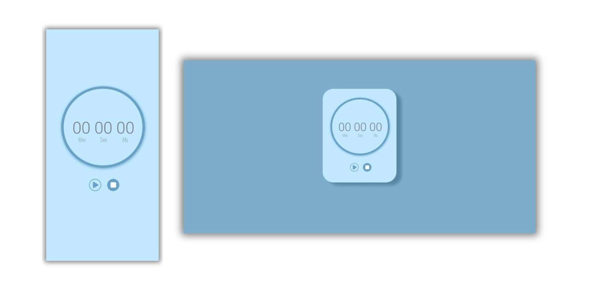

## stopwatch

## What is it?
This project is a fully functional timer developed using core web technologies: HTML, 
CSS, and JavaScript. It leverages the setInterval and clearInterval functions to
manage the time count, providing a simple and efficient experience.

## ✨ Features
1. Start, Pause, and Reset: Full control over the time count with intuitive buttons to start, pause, and reset the timer.
2. Responsive Interface: Adaptable design for different devices, ensuring a good experience on desktops, tablets, and smartphones.
3. Time Accuracy: Precise second count.
4. Clean and Modern Visuals: Minimalist styling developed with CSS to focus on usability and clarity.

## 🛠️ Technologies Used

## 📂 Project Link
https://stopwatchfabg.netlify.app/
